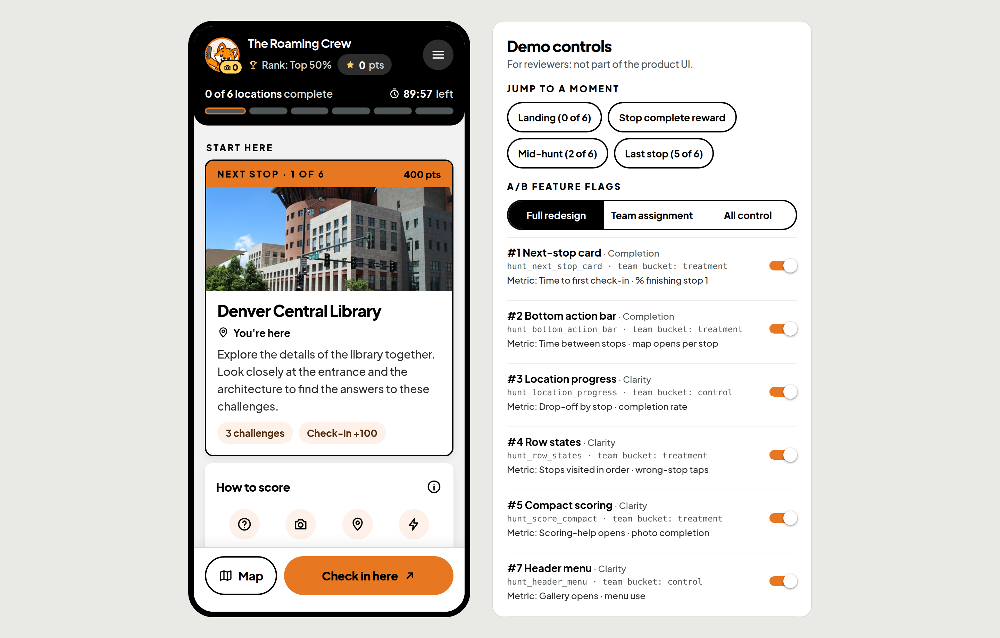
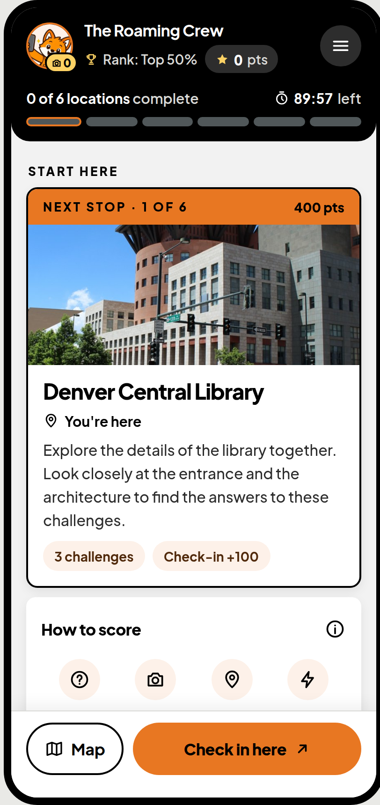
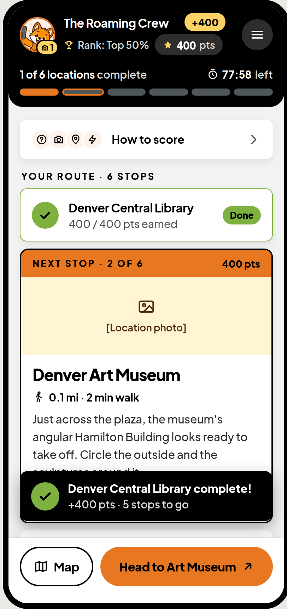
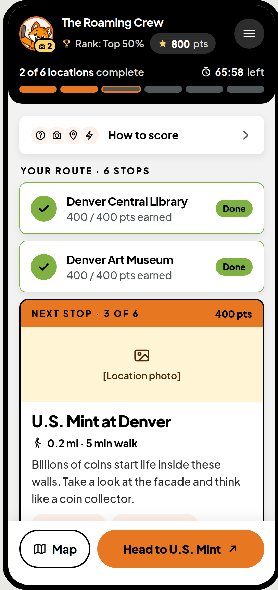
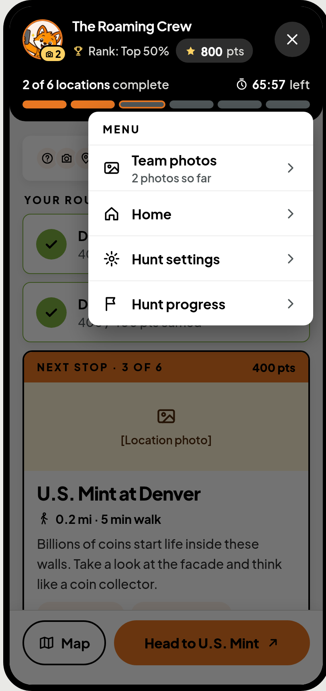
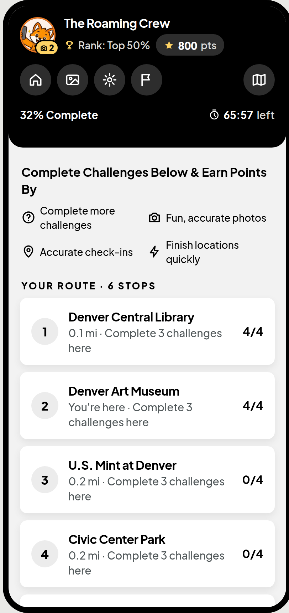
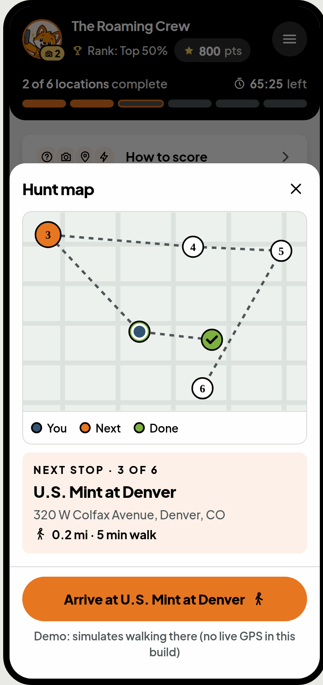

# Let's Roam: Main Hunt Screen Redesign

A redesign of the screen teams use for most of a Let's Roam scavenger hunt, built as an **Expo / React Native** app (iOS, Android and web from one codebase), with every change behind its own **A/B feature flag** and instrumented with the analytics events each test would be measured by.



| | |
|---|---|
| **Live demo** | `[RENDER URL]`: opens in any browser; on desktop the demo panel sits beside the phone |
| **Design (critique, redesign, test plan)** | [Design canvas](https://claude.ai/artifact/61er5rYaaczxhpj6A1SgDB) |
| **Stack** | Expo SDK 57 · React Native 0.86 · React 19 · TypeScript · react-native-web · Jest |

---

## The problem

Completion rate and customer satisfaction are dropping. The brief sets three goals: **completion**, **clarity** and **fun**.

**Core problem found:** the hunt screen gives teams **no clear first action** and **no sense of overall progress**.

## What changed and why

Each numbered point is a critique of the current screen. Each one ships behind its own flag so it can be tested on its own.

| # | Goal | Problem (current) | Fix (redesign) | Flag | Metric |
|---|---|---|---|---|---|
| 1 | Completion | Nothing says where to start | "Start here" next-stop card: expanded, pulsing, "1 of 6" | `hunt_next_stop_card` | Time to first check-in · % finishing stop 1 |
| 2 | Completion | Map and actions sit at the top, out of thumb reach | Sticky bottom bar: Map plus one primary action that always names the next step | `hunt_bottom_action_bar` | Time between stops · map opens per stop |
| 3 | Clarity | "0% Complete" doesn't say what it measures | "2 of 6 locations complete", one bar segment per stop | `hunt_location_progress` | Drop-off by stop · completion rate |
| 4 | Clarity | Every row looks the same | Done (green check) / Next (pulse) / Upcoming states | `hunt_row_states` | Stops visited in order · wrong-stop taps |
| 5 | Clarity | "Earn points by" is dense | Four icons with one word each; details behind (i); collapses after stop 1 | `hunt_score_compact` | Scoring-help opens · photo completion |
| 6 | Clarity | Small grey text; failing contrast outdoors | WCAG **AAA** text contrast, 14px minimum, 44pt targets | *Baseline for everyone, not a test* | Accessibility audit · mis-taps |
| 7 | Clarity | Header mixes orientation with navigation | Header keeps team, rank, points, progress and timer; nav moves to a menu; team photo opens the gallery | `hunt_header_menu` | Gallery opens · menu use |
| 8 | Fun | Rewards don't carry back to the hunt screen | "+pts" floats into the counter, the segment fills, the check pops, a toast confirms | `hunt_reward_carryover` | End-of-hunt rating · challenges per stop |

**Hunt structure:** the list now shows **locations only**: a hunt contains locations, and each location contains challenges.

### Accessibility

- Brand orange with white text is **2.96:1**, which fails even AA. The redesign uses **black on orange (7.09:1)**.
- Orange only appears on black or behind black text.
- Every text colour pair is checked in `src/theme/contrast.ts` and **enforced by the test suite**, so a token change can't quietly break readability.
- The app follows the OS **Reduce motion** setting. The demo panel can also force it on for preview.

| Landing | Stop complete | Mid-hunt | Menu | Control (all flags off) | Map |
|---|---|---|---|---|---|
|  |  |  |  |  |  |

---

## Run it

Requirements: **Node 20+** and npm.

```bash
npm install
npm run web          # dev server in the browser (press w if it doesn't open)
npm start            # then scan the QR code with Expo Go (iOS/Android) to run on a phone
npm test             # 27 unit tests: hunt logic, flag assignment, contrast
npm run typecheck
```

### Static web build (what Render serves)

```bash
npm run build:web    # outputs dist/
npm run serve:web    # serves dist/ at http://localhost:3000
```

`dist/` must be served over HTTP. Opening `index.html` straight from disk won't work, because of absolute asset paths.

### Deploy to Render

The repo includes a `render.yaml` Blueprint.

1. In Render, choose **New → Blueprint** and connect this GitHub repo.
2. Render reads `render.yaml`: a static site that runs `npm ci && npm run build:web`, publishes `dist/` and rewrites all routes to `index.html`.
3. Click **Apply**. Every push to the default branch redeploys.

---

## Using the demo

On a desktop browser, the **Demo controls** panel sits beside the phone. On a phone, tap the **Demo controls** strip at the top.

- **Jump to a moment:** landing, the stop-complete reward, mid-hunt (2 of 6), last stop (5 of 6).
- **A/B feature flags:**
  - *Full redesign*: all flags on.
  - *By team*: a real 50/50 split per flag, sticky per team. Use *New team* to re-roll.
  - *All control*: every flag off.
  - Each flag can also be switched individually; when off, it falls back to a simpler version.
- **Analytics events:** a live stream of every event the metrics above are computed from, such as `first_check_in` with `ms_since_landing`, `stop_completed` and `satisfaction_rating`.

**Playing the hunt:**
- Tap **Check in here**, then answer the trivia and take the (simulated) photos. Multiple-choice questions allow one attempt.
- Go **Back to the hunt** to see the reward carry over.
- Use **Head to…** and then **Arrive at…** on the map to simulate walking, since this build has no GPS.
- Completing all 6 stops shows the finish screen with its fun rating.

---

## How it's built

```
App.tsx                      shell: fonts, hunt state, flags, desktop/phone layout
src/data/huntData.ts         hunt content (same shape as the original hunt-data.js), 6 Denver stops
src/data/types.ts            types for that shape
src/logic/hunt.ts            pure hunt logic: stops, status, progress, points, reducer, demo presets
src/logic/flags.ts           flag definitions, FNV-1a team bucketing, mode/override resolution
src/logic/analytics.ts       event client + exposure logging (swap `track` for Segment/Amplitude)
src/screens/HuntScreen.tsx   the hunt screen; each change reads its own flag
src/components/              Header, Stops (next-stop card, rows, how to score), Overlays (bar, sheets, toast, menu),
                             Sheets (map, stop + challenges, gallery, finish), motion (reduced-motion aware), DemoPanel
src/theme/                   design-system tokens + contrast checks
```

**Decisions worth noting**

- **Flags are bucketed per team, not per player.** Teammates walk together on one or two phones. Splitting a team across variants would contaminate both arms of the test.
- **Exposure is logged once per flag and variant.** That event is the denominator for every metric.
- **Logic is pure and UI-free** (`hunt.ts`), so it's unit-tested and could move to a shared package or the server.
- **Sheets render inside the app, not as native modals**, so the web demo stays within its phone frame.
- **Design system:** Plus Jakarta Sans at 500 to 800 weight, the 2026 Q3 palette, pill buttons, 10–12px cards, and Foxtrot mascots from `assets/mascots`. The design system has no map, menu, check or camera glyphs, so `Icon.tsx` draws them to match.

## Data

`src/data/huntData.ts` keeps the original `window.HUNT_DATA` shape so it stays a drop-in:

- The original **Denver Central Library** stop is unchanged.
- Five **dummy stops** were added so progress has something to count: Denver Art Museum, U.S. Mint, Civic Center Park, Colorado State Capitol and History Colorado Center.
- The three original standalone challenges are kept under `_unused_*` for reference.
- Each stop's `totalLocationPoints` equals the check-in points plus its challenge points (checked by a test).

## Not in scope (backlog)

- Points mismatch in the current app: the location sheet shows 300 pts and check-in shows 400 pts for the same stop.
- Explaining how the speed bonus is calculated.
- Progress design for long hunts with many locations.
- Live GPS, uploads, backend and login are all simulated in this demo.
